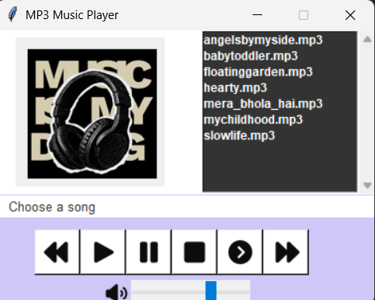

# 🎵 MP3 Music Player

A simple and user-friendly **MP3 Music Player built with Python**. The application provides an easy-to-use graphical interface for playing and managing local music files.

## 📌 Features

* 🎵 Play selected songs
* ⏸️ Pause currently playing music
* ▶️ Continue/resume paused music
* ⏹️ Stop music playback
* ⏮️ Play the previous song
* ⏭️ Play the next song
* 🔊 Adjust music volume
* 📜 Display available songs in a scrollable playlist
* 🎨 Simple and clean graphical user interface
* 🖼️ Custom icons and music-player interface

## 🛠️ Technologies Used

* **Python**
* **Tkinter** – For creating the graphical user interface
* **Pygame Mixer** – For playing and controlling MP3 audio
* **Pillow (PIL)** – For loading and resizing images
* **OS Module** – For accessing music files from the project folder

## 📂 Project Structure

```text
MP3-Music-Player/
│
├── images/
│   ├── image.png
│   ├── backward.png
│   ├── play.png
│   ├── pause.png
│   ├── stop.png
│   ├── continue.png
│   ├── forward.png
│   └── volume.png
│
├── music/
│   ├── song1.mp3
│   ├── song2.mp3
│   └── ...
│
├── music_player.py
└── README.md
```

## ⚙️ Requirements

Make sure Python is installed on your system.

Install the required libraries using:

```bash
pip install pygame pillow
```

> Tkinter is generally included with Python. If it is not available on your system, install the appropriate Tkinter package for your operating system.

## 🚀 How to Run

### 1. Clone the repository

```bash
git clone https://github.com/yourusername/MP3-Music-Player.git
```

### 2. Open the project folder

```bash
cd MP3-Music-Player
```

### 3. Install dependencies

```bash
pip install pygame pillow
```

### 4. Add your music

Place your `.mp3` files inside the:

```text
music/
```

folder.

### 5. Run the application

```bash
python music_player.py
```

## 🎮 Controls

| Button      | Function                     |
| ----------- | ---------------------------- |
| ⏮️ Previous | Plays the previous song      |
| ▶️ Play     | Plays the selected song      |
| ⏸️ Pause    | Pauses the current song      |
| ⏹️ Stop     | Stops playback               |
| ▶️ Continue | Resumes paused music         |
| ⏭️ Next     | Plays the next song          |
| 🔊 Volume   | Controls the playback volume |

## 🖥️ Interface

The application contains:

* **Left Panel** – Displays the music-player image
* **Right Panel** – Displays the available songs in a playlist
* **Bottom Panel** – Contains the song name, playback controls, and volume control

## 💡 How It Works

The application scans the `music` folder using Python's `os` module and displays the available files in the playlist.

When a song is selected, **Pygame Mixer** loads and plays the MP3 file. The playback buttons allow the user to pause, resume, stop, and switch between songs. The volume slider controls the playback volume dynamically.

## 📸 Working / Project Preview

The MP3 Music Player provides a simple interface where users can select songs from the playlist and control playback using the available buttons.



### 🎵 Working Flow

1. **Select a song** from the playlist.
2. Click **Play** to start the selected song.
3. Use **Pause** to temporarily stop playback.
4. Use **Continue** to resume the paused song.
5. Use **Previous** and **Next** to navigate through the playlist.
6. Use **Stop** to stop the current song.
7. Adjust the **volume slider** to control the audio level.


## 👩‍💻 Author

**Kanika Banga**

B.Tech – Computer Science & Engineering
Meerut Institute of Engineering and Technology (MIET)

---

⭐ If you like this project, consider giving the repository a star!
